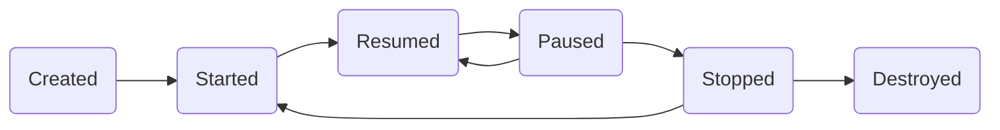

# Data Structure 

#### HASH

단방향 데이터 매핑. 고정된 길이의 값을 얻음. 보안. 충돌 문제 해결. 

#### HASH TABLE

삭제와 검색의 속도가 O(1)이다(collision 없을시) 

**hashing** : hash function거쳐서 key의 인덱스에 넣는다.-->collision발생 
해결책:

1. **open address** :다른 해시 버킷에 해당자료 삽입 + 캐시 사용 가능. 

   key+ data를 모두 저장한다. 포인트를 안써서 성능향상 (chain불가능)

   * liner probing: 이미 그 슬롯이 차있다면, 그 위에 슬롯에 저장한다. primary clustering문제점있다. 데이터들이 특정위치에만 밀집하는 형상. slot이 많아지면 탐색시간 엄청 늘어남.
   * quadaratic probing : `h(k,i) = (k+i^2)%m`의 형태. 충돌 일어날 경우 i를 하나씩 올려서 계산한다(초기 = 0) secondary clustering발생. 처음 해쉬값 같을경우 이후 해쉬값도 동일하게 계산되는 현상.
   * double hashing: `h1(k) = k%m`, `h2(k)=k%m2` 이면, `h(k,i)=(h1(k)+i*h2(k))%m` 형식.
     두가지 해쉬함수를 이용한다. secondary clustering 해결! 

2.  **separate chaining**: 빠르다. 데이터 적을때 이용. 버킷당 key-value 6/8개 기준
   
   * linked list(데이터 적을시 메모리 이득) 
   * tree : red-black tree(데이터 많을시 속도 빠름) 이용. 

* simple uniform hash : 1)해쉬값0부터 배열크기 동일한 확률로 나올것
      2)해쉬값들은 연관성없이 독립적으로 생성될것

* division method : %(modular)연산을 이용한 대표적 해쉬 함수. %는 키의 수의 3배가 적당 
* 현재 데이터 개수가 버킷개수의 75%가되면 해시 버킷 2배로 확장 

#### Sorting Algorithm 

[[link]]( [https://ratsgo.github.io/data%20structure&algorithm/2017/10/19/sort/](https://ratsgo.github.io/data structure&algorithm/2017/10/19/sort/) )

| Algorithm | In-Place | Stable | Comparison |    Complexity    |
| :-------: | :------: | :----: | :--------: | :--------------: |
|  Bubble   |    O     |   O    |     O      |     $O(n^2)$     |
| Selection |    O     |   O    |     O      |     $O(n^2)$     |
| Insertion |    O     |   O    |     O      |     $O(n^2)$     |
|   Shell   |    O     |   O    |     O      |     $O(n^2)$     |
|   Merge   |    X     |   O    |     O      |    $O(nlogn)$    |
|   Heap    |    O     |   X    |     O      |    $O(nlogn)$    |
|   Quick   |    O     |   X    |     O      |    $O(nlogn)$    |
| Counting  |    X     |   O    |     X      |     $O(n+k)$     |
|   Radix   |    X     |   O    |     X      | $d\times O(n^2)$ |
|  Bucket   |    X     |   O    |     -      |      $O(n)$      |

- **버블정렬(Bubble sort)** : 주어진 배열의 마지막 위치에 있는 요소를, 정렬되지 않은 `직전 요소`부터 `첫 요소`에 이르기까지 비교해 정렬 순서가 맞지 않은 모든 *case*에 대해 요소 위치를 바꿔줌. 이를 요소 수만큼 반복. 가장 간단하지만 비효율적인 알고리즘.

- **선택정렬(Selection Sort)** : 요소 위치 변경 횟수를 줄여 버블정렬을 일부 개선한 알고리즘. 정렬 순서가 맞지 않으면 무조건 자리를 바꿔줬던 버블정렬과 달리, 1회 *iteration*마다 최소값(혹은 최대값)을 찾고 단 한번만 해당 요소 위치를 바꿔줌.

- **삽입정렬(insertion sort)** : 모든 요소에 대해 앞에서부터 차례대로 이미 정렬된 배열(*sorted list*)과 비교하여 *sorted list* 내 자신의 위치를 찾아 `삽입`함으로써 정렬을 완성, 입력데이터가 이미 정렬된 상태라면 $O(n)$의 빠른 속도를 보이지만 그렇지 않은 경우 다른 기법을 적용하는 것이 나음.

- **쉘정렬(shell sort) **: 정렬되지 않은 배열의 경우 비효율적인 삽입정렬을 개선한 기법. 주어진 배열의 일정 간격(*gap*)만큼의 요소들에 대해 삽입정렬을 반복 수행.

- **합병정렬(merge sort)** : 리스트를 잘게 쪼갠 뒤 둘씩 크기를 비교해 정렬하고 분리된 리스트를 재귀적으로 `합쳐서` 정렬을 완성, 분할된 리스트를 저장해둘 공간이 필요해 메모리 소모량이 큰 편

  ```python
  def merge_sort(list):
      if len(list) <= 1:
          return list
      mid = len(list) // 2
      leftList = merge_sort(list[:mid])
      rightList = merge_sort(list[mid:])
      return merge(leftList, rightList)
  
  def merge(left, right):
      result = []
      while len(left) > 0 or len(right) > 0:
          if len(left) > 0 and len(right) > 0:
              if left[0] <= right[0]:
                  result.append(left[0])
                  left = left[1:]
              else:
                  result.append(right[0])
                  right = right[1:]
          elif len(left) > 0:
              result.append(left[0])
              left = left[1:]
          elif len(right) > 0:
              result.append(right[0])
              right = right[1:]
      return result
  ```
  
- **힙정렬(heap sort)** : 모든 노드가 힙 속성(각 노드의 값이 자신의 자식노드 값보다 큰 *완전이진트리*)을 만족하도록 재귀적으로 트리 구조를 만들어 정렬을 완성

  * siftDown: 이 노드가 주어진 트리에서 힙 성질 갖도록 만든다. $O(log\space n)$

  * insert, delete: 노드 추가/제거후 downheap. $O(logn)$

  * heapify: leaf 위에 노드부터(n/2) root까지 downheap

    ​      $index =n$ 는$\frac{n}{2}$개 존재 $index=\frac{n}{2}$ 는 $\frac{n}{4}$개  ... so on 

    ​	   heigh $\times$ 노드수 의 시간필요. 계산하면 
    $$
    =\sum_{i=0}^{\infin} i \times \frac{n}{2^{i+1}}
    = \frac{n}{4}\times(1+2\times\frac{1}{2}+\frac{2}{3}+...) = \frac{n}{4}\times c = O(n)
    $$

  * heapsort : build heap 후 노드개수만큼 root& last swap -> siftDown = $O(n)+O(nlogn) = O(nlogn)$

  

- **퀵정렬(quick sort)** : 피봇값을 기준으로 피봇 앞에는 피봇보다 작은 값, 뒤에는 큰 값이 오도록 하여 리스트를 분할하고, 분할된 두 개 리스트 각각에 재귀적으로 이 과정을 반복해 정렬을 완성. 합병정렬과 달리 주어진 배열을 임의로 나누지 않기 때문에 대개는 효율적이지만, 피봇값이 잘못 선택되면 $O(n^2)$이 될 수도 있음.

  ```python
  def quick_sort(ARRAY):
      ARRAY_LENGTH = len(ARRAY)
      if( ARRAY_LENGTH <= 1):
          return ARRAY
      else:
          PIVOT = ARRAY[0]
          GREATER = [ element for element in ARRAY[1:] if element > PIVOT ]
          LESSER = [ element for element in ARRAY[1:] if element <= PIVOT ]
          return quick_sort(LESSER) + [PIVOT] + quick_sort(GREATER)
  ```

  ```c++
  void quick_sort(int* data, int start, int end) {
  	
  	if (start >= end) {
  		return;
  	} int pivot = start;
  	int i = pivot + 1;
  	int j = end;
  	int temp; while(i <= j){
  		while(i <= end && data[i] <= data[pivot]){ i++; }
  		while(j > start && data[j] >= data[pivot]){ j--; }
  		if(i > j){
  			temp = data[j];
  			data[j] = data[pivot];
  			data[pivot] = temp;
  		}
  		else{
  			temp = data[i];
  			data[i] = data[j];
  			data[j] = temp; }
  	} 
  	quick_sort(data, start, j - 1);
  	quick_sort(data, j + 1, end); }
  ```

- **카운팅정렬(counting sort)** : 입력값의 빈도를 세어서 이를 결과리스트의 인덱스로 활용, 입력리스트의 요소값을 해당하는 결과리스트 인덱스 위치에 채워 넣는 방식으로 정렬을 완성, 입력리스트의 최대값(kk)이 커지면 복잡도가 크게 높아짐

- 래딕스정렬(radix sort) : 입력값의 자릿수(dd) 각각에 대해 카운팅정렬을 적용해 카운팅정렬의 단점 보완, 예컨대 10진법으로 표현된 입력값에 래딕스정렬을 적용하면 kk값이 9로 작아짐

- 버킷정렬(bucket sort) : 데이터 개수만큼의 버킷을 두어 데이터를 나누고 버킷별로 정렬한 후 합쳐 정렬을 완성, 데이터 분포가 균등할 경우 계산복잡성을 낮출 수 있으나 그 반대의 경우 효과를 기대하기 어려울 수 있음

#### Deterministing algorithm vs randomized algorithm

라스베가스 알고리즘: 결과는 항상 옳지만 오래걸릴 확률이 있음 ex) quick sort
몬테카를로 알고리즘: 계산을 빠르지만 결과가 틀릴 확률이있음 

#### backtracking

dfs의 경우 무한하게 트리의 깊이가 깊어질 수 있다. 때문에 깊이 제한 설정을 해놓고 넘어가면 부모노드 돌아오게 하는것. 

#### Array vs Linked list

array : random access가 가능하다. 삽입, 삭제가 느리다. shift해줘야하기때문
linked list : 삽입 빠르다. search느리다O(n). 

#### BST 

left child = smaller, right child = bigger. 중위순회시 정렬값. 노드 저장 값은 유일 값

* 탐색속도는 평균 O(log n), worst(skewed) O(n)
* 삽입 : $O(1)$

* delete :  
  * 삭제노드의 자식노드 없는경우 : 그냥 삭제
  * 자식노드 하나있는경우 : 삭제후 자식을 부모와 연결
  * 자식노드 두개있는경우 : 
    1. 오른쪽 서브트리 찾는다
    2. 그 중 최소값 찾는다
    3. 삭제 노드 위치에 최소값을 옮긴다 


**red-black tree**
 root = black. leaf node = black. if parent = red, then childs = black 
 ...자가 균형(self balancing) 이진탐색트리. 일정한 실행 시간을 보장. 

#### AVL tree

노드는 왼쪽 오른쪽 서브트리의 높이차를 뺀 *Balance Factor(BF)*를 가진다.

BF가 2이상이 되면 그 서브트리들의 위치를 rotation 해준다. 

#### DFS 

stack 이용. 한방향으로 쭉. O(V+E)

#### BFS 

queue 이용. 문어발. O(V+E).. 최단경로 

#### minimal spanning tree

1. kurskal : weight 가장 작은 edge부터 놓는다. cycle있으면 넘어감. (disjoint set forest) O(E log E)
2. prim: 시작점에서 가장 작은 edge들로 이어나간다. O(E log V)

# C++

#### 포인터 vs 레퍼런스

1. 레퍼런스는 NULL이 없다. 
2. 레퍼런스는 참조대상 변경이 불가능하다.(선언과 동시에 초기화 해야된다)

3. 포인터는 주소값, 레퍼런스는 참조값 그대로 

**cpp virtual**:  실행시간에 함수의 다형성 구성... 추상화 기능 구현에 사용

#### cpp smart pointer

 new하면 delete해줘야함.(memory leak) sp는 자동으로해준다 
 ```unique_ptr<int> ptr1(new int(5))```이런식.
``` shared_ptr<int> ptr1(new(int5))``` 하면 참조 횟수 볼 수 있다.

**struct 크기** : 가장 큰 자료형의 배수에 맞춰진다.(int a, char b 있다면 5가 아니라 8)

# JAVA

#### GC

 [link]( https://yaboong.github.io/java/2018/05/26/java-memory-management/ )

 사용하지 않는 객체 해제해준다.  JVM의 heap 공간에서 발생. 

* `Mark and Sweep`: JVM이 스택의 모든 변수를 스캔하면서 각각 어떤 오브젝트 레퍼런스하고있는지 mark(이 때 stop the world 발생). mark안된 오브젝트 힙에서 제거하는 과정이 sweep.

* weak generational hypothesis : GC도입가능 이유. 
  1. 대부분 객체는 금방 unreachable이된다.
  2. 오래된 객체에서 젊은 객체로의 참조는 매우 적다
      어떤 객체를 지울까? 더이상 참조 되지 않을때. 
      객체는 (young)eden->survivor1->survivor2->old->permenent 로 옮겨간다 

 GC할 때는 stop-the-world현상이 발생한다.(thread 빼고 잡업 정지) 이 시간을 줄이는게 관건 .
 GC종류로는 serial, parallel, CMS, G1 등이있다.

#### App Life Cycle



* onCreated() : Activity처음에 호출. 최초로 실행
* onStart(): Activity 다시 시작전에 호출. 사용자에게 보여지기 직전
* onResume(): 화면에 보여지는 단계, 사용자에게 Focus잡은 상태
* onRestart(): Stopped에서 다시 start할 때 불린다 

다른 어플에서 호출하는 액티비티  :

* onPause(): 다른엑티비티가 올라와서 지금게 focus잃었을 때. 일부분이 보일때 호출된다. 
* onStop(): 다른엑티비티가 100프로 가릴때 호출. 홈키 누르는경우. 이상태에서 다시 Activity불러질 경우 onRestart() 호출된다.
* onDestroy(): 액티비티가 완전히 스택에서 없어질 때 호출. 


#### OOP
객체들이 서로 유기적으로 동작하는 프로그래밍 이론

코드의 재사용성과 중복제거가 가장 큰 목적

- **추상화**
  - 목적과 관련이 없는 부분을 제외해서 필요한 부분을 포착하는 기법
  - 객체의 공통된 속성들 중 필요한 부분을 포착해서 클래스로 정의하는 설계 기법
  - 꼭 넣어야 하는 기능일 경우 추상화로 강제한다. 
  
- **캡슐화**
  - 외부에 노출할 필요가 없는 정보들은 은닉 (정보은닉)

- **상속**
- 상속 관계에 있는 두 클래스에 대해, 부모 클래스가 자손 클래스에게 속성을 물려주는 것
  - 코드의 재사용이 목적
  
- **다형성**
  - 같은 형태이지만 다른 기능을 하는 것
  - 오버라이딩은 이와 관련된 기능임

# OS

#### big-endian vs little-endian

big: 큰 단위가 앞으로온다. 0x1234 = 12 34. 디버킹 편하다. TCP에서 이용.
small:작은 단위가 앞으로온다 0x1234 = 34 12. 하위 바이트 별도 계산 필요없다.

#### race condition

 프로세스의 resource 개입 순서에 따라 결과가 달라질수있음
 해결책 : 프로세스 협력 기법 (세마포어, 뮤텍스, 피터슨 알고리즘 등)
 뮤텍스, 세마포어차이는? 크리티컬 섹션 이용 가능 프로세스가 하나면 뮤텍스.

#### process vs thread 
**process** : code, data, stack heap 할당. 장점) 문제생겨도 다른 프로세스 영향x, context switching 시 캐시 메모리 비워야 되서 느리다. 

**thread** : stack,pc register 만 할당. 나머진 공유. 장점) context switching overhead적다.자원 소모 적다 
       단점) 동기화 문제(전역변수 공유)
      +pc regester는 스레드가 어디까지 명령을 수행했는지 나타낸다. 

#### Mutex vs Semaphore

**mutex** : 하나의 키를 가지고 라킹 상태. wait or lock 둘중 하나다. locking mechanism

```python
wait (mutex);
    ...
#Critical Section
    ...
signal (mutex);
```

**semaphore** : signal mechanism. int counter 로 필요한 쓰레드가 진입.

 한번에 여러개 진입가능(최대 허용치많큼), 단지. 한번에 하나의 쓰레드만 접근가능.

```python
wait(S)
{   
    while (S<=0);
     S--;
}
signal(S)
{
    S++;
}
```


#### PCB(Process Control Block)
프로세스에 대한 중요한 정보 저장하고있다. context switch에 이용. 
+왜 스레드의 context siwtch는 프로세스것보다 빠를까? 쓰레드의 cs는 캐시 메모리를 비울 필요가 없기 때문. 

#### 메모리 영역

1. 코드 : 코드 자체가 올라가있다(BIN파일). 
2. 데이터 : 전역변수, static, struct, array. 프로그램 시작때 생성, 종료시 반환
3. 힙 : 프로그래머가 할당. malloc, new ..  
4. 스택 : 프로그램 수행. 할당, 해제 (local, parameter, return, function...). 함수 호출시 해제      끝나면 반환 . 맨끝에서 내려온다 
    추가) bss: 초기화하지 않은 전역변수들. 이름만 저장해놓는다 

#### 프로세스 스케쥴러

job queue(모든 프로세스), ready queue, device queue스케쥴링
장기스케줄러 : 메모리와 디스크사이
단기 : cpu와 메모리 사이
중기: 프로세스를 디스크로

#### CPU 스케줄러

ready queue 대상

1. FCFS : first come, first served. 비선점형(non-premptive). convy effect(효율성 별로)
2. SJF : shortest job first. 대기중 가장 짧은애부터 non-preemtive.
3. SRT: shortest remaining time first. 새로 프로세스 도착때마다 새로 계산. preemptive. starvation. 
4. priority scheduling : 수선순위. 선점형, 비선점형 둘다가능. starvation
5. round robin : time quantum할당. 그 시간동안만돌고, 제일 뒤에가서 줄선다.

#### Critical section 

필수조건

1. mutual exclusion: 임계영역은 한번에 하나만 가능하다. 
2. progress: 하나가 cs사용 끝내면, 다른이가 사용한다. 
3. bounded waiting : 임계구역 요청후 일정 기간내에 요청이 받아들여져야한다.

#### dead lock

필수조건

1. mutual exclusion, 
2. wait for: 다른 프로세스 자원 해제되길 기다리는 프로세스 존재
3. no preemption
4. circular wait : 자원할당 그래프상에서 cycle 존재 . 

#### memory fragmenation

1. swapping : 메모리에 프로세스 올리고, 하드디스크로 내보는 일
2. fragmentation :  
   * 내부단편화 = 프로세스 내부에 남는 공간
   * 외부 단편화 = 프로세스들 사이 남는 공간 
3. paging : 외부단편화 해결. 메모리는 frame이라는 고정크기. frame으로 나눠서 넣는다. 단점. 내부 단편화 늘어남. 

#### 가상 메모리

가상 주소공간 준다. 

#### 요구 페이징
프로세스 한번에 전부 메모리에 올리는게아니라 필요한 부분만 올린다. 페이지 교체과정은 : 디스크에서 페이지 위치 찾고, 빈페이지 프레임 찾고, 프레임 테이블 수정. 
페이 교체 알고리즘

* FIFO: first in , first out 

* optimal page replacement: 가장 오래동안 사용되지 않을 페이지 찾아 교체(이상향)

* LRU: least recently used

* LFU:least requently used 

* MFU: most requently used. 

#### paging vs segmentation 
세그먼테이션: 서로 다른 크기의 논리적단위로 분할. 세그먼트 번호 + 크기로 지정. 외부단편화 발생. 
페이징: 가상메모리를 페이지로 나눈다. (물리는 프레임). 프로그램이 페이지 여러개 할당받아서 나눠 넣는다. 내부단편화 발생. 

#### 커널 메모리
커널은 

1. 데이터사이즈가 작아 내부 파편화가능성이 높으며
2. 하드웨어 장치로 직접 접근하기때문에 물리적으로 연속적이여야한다
    때문에 메모리 풀을 이용한 메모리할당을 한다 
    Buddy system : 메모리를 2의 지수승으로 잘라서 나눠준다. buddy또한 해제되면 다시 합병된다. 
    slab allocation: 메모리를 작게 잘라두고, 요청하는 크기에 맞게 준다. (머가다르지)

# Network

#### OSI 7계층
1. 물리 : bit. 물리적 데이터 연결. 이더넷, 모뎀
2. 데이터 링크: frame. 물리적 전송.에러검출, 흐름제어. MAC,ATM. 무선랜
   * MAC 주소이용해서 통신
   * CSMA/CA : 무선에서 충돌감지 하기 힘듬. 회피.
   * ARP : IP주소를 MAC address로 전달하기 위해 사용
3. 네트워크: packet. 발신지로 가장 빨리 전달. 라우터
   * IPv6, Qos
   * RIP: 다익스트라 or 벨만포드. 라우팅 테이블 제작
4. 트랜스포트: segment. 신뢰성있는 데이터 전송. TCP,UDP,RTP. 게이트웨이
   * error control: checksum. 헤더만 체크. 
5. 세션: data. 장치간 동기화,데이터 분리후 포트연결. SSH. OS
6. 프레젠테이션. data. 데이터를 표현 형태로 변환. ASCII등 변역. JPEG, GIF
7. 어플리케이션. data. 사용자가 네트워크 접근. HTTP, DNS, SMTP, RTSP, DHCP

#### 3-hand-shaking: TCP장치간에 논리적 접속 성립. 
1. client -> server 접속 요청SYN 패킷. client는 closed에서 syn_sent 상태로

2. server -> client 접속 수락 ACK+syn패킷 발송. 서버는 syn_received 상태

3. client -> server ack 보낸다. 연결됨. 

    +) 종료할때는 4way handshake.

   1. client종료 요청
   2. 서버 어플 종료명령ack 
   3. 서버 어플 종료FIN 
   4. client ACK

#### HTTP method
1. GET: 데이터 받아오기 URL뒤에?붙여서 나감. 크기 제한적. 보안 취약 
2. POST: 데이터 만들기. https message body에 담긴다. 
3. PUT: 데이터 전체 업데이트 
4. DELETE: 데이터 지우기 

#### http1.1 vs http2.2 
http1.1:연결당 하나의 요청과 응답. 
http2.2:훨빠르다..요청 병렬로 보냄. 

#### https
s = secure socket. SSL이용. 비대칭키 암호화 방식 이용

http request를 SSL socket에서 처리한다. 

서버가 클라이언트로 인증. 

```sequence
Client->Server: 1.client hello
Note left of Client : 1.클라이언트가 생성산 랜덤 데이터,\n 사용가능한 암호화 방식 후보들 
Server->Client: 2. server hello
Note right of Server : 2. 서버가 생성한 랜덤 데이터,\n 선택한 암호방식\n인증서 
Note over Client: 3. 인증서 확인, pre master secret암호화 \n인증서 확인(by CA?)
Client->Server : 4. pre master secret\n인증서 안의 공개키 이용
Note over Server: 5. pre master secret 복호화\nby 자신의 비공개 키
Note over Client,Server: 6. master secret, session key(대칭키) 생성
Note right of Server : 1~6 : SSL handshake
Client->Server : 7. data: session key 이용한 대칭키 암호화 통신
Server->Client : 
Note right of Server : 7: session
Client->Server : 8. 세션종료시, session key 폐기
Server->Client :
Note right of Server : 8: end session
```

[link]( https://opentutorials.org/course/228/4894 )

#### 대칭키, 비대칭
대칭키 : 파일 암호화, 복호화 모두 같은 키 이용. 키 관리가 중요하다
비대칭키 : 개인키로 암호화, 공개키로 복호화. 역도 성립. 암호화, 복호화 키 다름 = 비대칭키 암호.  ex)RSA


#### TCP

 reliable, connection control, flow contorl, congestion control. 호스트에서만 작동(중간 라우터x)

full-duplex(저송, 수신 동시에 가능), point to point (정확히 2개의 종단점)

* **Flow Control**

  송신측의 속도가 수신측보다 빠를경우 생기는 문제 방지하기 위해 생김. 수식측의 저장용량 한계 있기 때문. 송신측의 전송량을 수신측에 맞게 조절해야한다

  * Stop and Wait

    패킷 전송할때마다 ACK 받은거 확인해야 다음 패킷 전송 

  * Sliding Window 

    window : 전송, 수신 스테이션에 만들어진 버퍼의 크기 

    데이터 송/수신하면 window 줄어듬 

    ACK 송/수신하면 window 증가 

    

* **Congestion Control**

  한 라우터에 데이터 몰릴 수 있다. 이경우 전송속도 강제로 줄임. 

  패킷전송 실패하거나 일정 시간 넘기면 속도를 절반으로 줄임. 

  * fast retransmit : 중복된 패킷 3개 받으면 바로 다시전송 
  * slow start : threshold까지 전송 2배로 증가시킨다 
  * fast recovery: window size 1로 줄이지 않고 반으로 줄인다 

* 오류 제어(error detection & retransmission)

  * Stop and Wait

    패킷 전송할때마다 ACK 받은거 확인해야 다음 패킷 전송 

  * GBN(go back and)

    슬라딩 윈도우 프로토콜. 맨앞데이터ACK 받으면 슬라이드 옮긴다.
    하지만 중간 데이터 로스나면 슬라이드 처음부터 다시 전송 
    -->분실 이후 프레임 모두재전송. 구현단순 

  * SR(selective repeate)

    받는쪽에도 저장공간이 있다. 받는쪽에서 못받은것만 다시 보내라고한다. 
    하지만 문제있다. 재전송시 재전송된 데이터인지, 새로운 데이터인지모름. 
    해결하기위해선 windowsize를 순서보다 작게한다..


#### MQTT

 message queue telemetry transport. 가벼운 메시징 프로토콜.
IoT, 모바일. Broker pattern이용. broker란 중계자가 중계. 

#### 소켓통신 WorkFlow

```sequence
participant server
participant client

note over server,client: socket()

note over server: bind()
note over server: listen()
note over client: connect()
client -> server: connect request
note over server: accept()
note over client: write()
client -> server: send request
note over server: read()
note over server: write()
server -> client: send response
note over client: read()
note over client: close()
client -> server: end connetion
note over server: close()


```


#### DHCP

* 클라이언트에서 ip 할당받는 프로토콜. 

1. 접속하는 클라이언트가 broadcast로 DHCP유뮤 확인
2. DHCP도 broadcast에세 클라이언트에게 ip 전달
3. 클라이언트가 ip사용한다고 DHCP에게 broadcast
4. DHCP ACK


# DATABASE

* DML = data manipulation language.
   select, insert, update, delete. 데이터 조회,변형
   
* DDL = data definition language
   create, alter, rename, truncate, alter 데이터 구조 관련
   
* DCL = data control language 
  
   commit, rollback, grant, revoke

특징 : 데이터 독립성, 무결성, 보안성, 일관성, 중복 최소화

#### key 
유일성을 가져야함. null이 있으면안됨(개체 무결성). 조건만족하면 후보키. 이중 기본키 하나 선택. 대체키는 기본키 제외한 후보키. 
슈퍼키: 같은 줄 여러개의 속성들로 만듬. 최소성(어떤 속성 뽑아도 유일)만족 못함. 
외래키: 관계 맺고 있는 테이블의 기본키와 같은 속성일때. 무조건 참조 테이블에있는 값만 입력가능(참조 무결성 조건) 

# Security

#### 중간자 공격

도청이랑 비슷

1. sniffing: 데이터 패킷 캡쳐 
2. packet injection : 일반데이터와 함께 악의적 데이터 주입.
3. session hijacking 
4. SSL stripping. https를 http로 전환시킴
    ->방어: HSTS: http로 입려해도 https로 연결됨. 

#### 랜섬웨어:
사용자 파일 암호화해서 인질로 잡고 금전 요구. 

# ETC

* **라이브러리**: 프로그램 제작시 필요한 기능. 자동차 바퀴
  재사용이 필요한 기능을 만들어 놓은것. Class나 Fcuntion으로 이루어져있다.

* **프레임워크**: 프로그램 기본 구조. 자동차 프레임
  라이브러리 포함. 빠르게 개발 도와줌. ex)spring, django

* **아키텍쳐** : 프로그램 주요 구조 설계. 자동차 도면
  주요 특징 기술적으로 설계. 

* **플랫폼**:프로그램 실행 환경. 자동차 주행환경
  플랫폼 위에 플랫폼 가능. ex) windows, 앱스토어

####  분산처리 시스템. 
하나의 작업에 여러대 machine. message passing interface.
단점: 복잡한 프로그래밍(data sync), 컴퓨터 일부만 고장나도 문제
분산처리, 분사저장

* **spoofing** : ip주소를 포함한 네트워크 정보의 일부를 가짜로 교채해서 보내는것

* **nuke**: 파편또는 유혀하지않은 ICMP를 대량으로 보낸다. 느리게만든다. 

#### Json vs XML

공통점:

* 데이터 전달용
* 가독성 뛰어남
* 계층적인 구조
* XMLHttpRequest 객체 이용해서 서버로부터 전송

차이점: 

* Json는 종료태그 x
* Json이 더 간결, 읽고 쓰는데 빠름
* Json은 배열 사용가능
* XML은 XML파서, Json은 eval()파서 
* XML은 데이터 검증가능. 
* XML은 메타데이터 지원 

#### Web Server vs WAS

웹서버 : *정적*  (html, css,js) 제공하는 서버

WAS : DB조회, 로직처리 등 *동적* 컨텐츠 제공하는 서버 

#### RESTful API

HTTP Method 통해 차원 처리 설계. 

GET, POST, PUT, DELETE라는 *행위* 통해서 *리소스*를 주고받는다.

#### 함수형 프로그래밍

how?가 아니라 what.  ... *보강필요*

#### MVC

**Controller, Model, View**

CONTROLLER *manipulates* MODELS

MODEL *updates* VIEW

VIEW *sees* USER 

USER *uses* CONTROLLER

#### OOP 개발 5대원리

* **SRP**(single responsibility princile) : 단인책임의 원칙

  클래스는 하나의 기능만 가지며 모든 서비스는 그 하나의 책임을 수행하는데 집중해야함.

* **OCP**(open close principle) : 개방폐쇠의 원칙

  확장에는 열려있고 변경에는 닫혀있어야한다. 추가요구시 기존 코드 바꾸지말고 기존코드 재사용해서 확장 가능해야 할 것. key) 추상화, 다형성 

* **LSP**(liskov substitude princile) : 리스코브 치환의 원칙

  서브타임은 언제나 기반타입으로 교체할 수 있어야한다. (기반타입 약속한 규약 지켜라)

* **ISP**(interface segregation principle) : 인터페이스 분리의 원칙

  클래스는 자신이 사용하지 않는 인터페이스는 구현하지 않아야 한다. (인터페이스 단일 책임)

* **DIP**(dependency inversion principle) : 하위레벨이 상위레벨의 변경을 요구하는 관계 없게 

  컴포넌트간의 커뮤니케이션 관계 단순화.